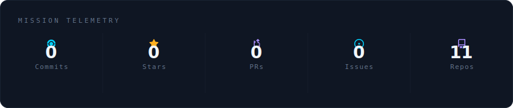

  

 

  

 

  

 

  

 

<strong>🚀 Mais sobre mim</strong>

 

Estudante de **Engenharia de Computação** em Fortaleza/CE, focado em transformar dados em inteligência. Tenho forte interesse em Ciência de Dados, Engenharia de Dados e na performance de sistemas de baixo nível.

**Principais Competências:**
* **Data Science:** Python (Pandas, Scikit-learn, XGBoost), PCA e análise estatística.
* **Data Engineering:** SQL (PostgreSQL/Server), modelagem de dados e Cloud (Azure).
* **Engenharia:** Linguagem C, Arquitetura de Computadores (MIPS) e Redes (Huawei HCIA).

**Localização:** Fortaleza, Brasil 🇧🇷

 

  
  
  

